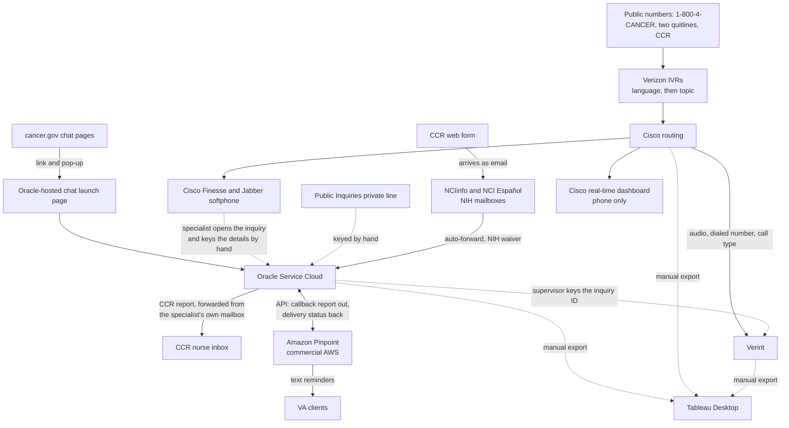
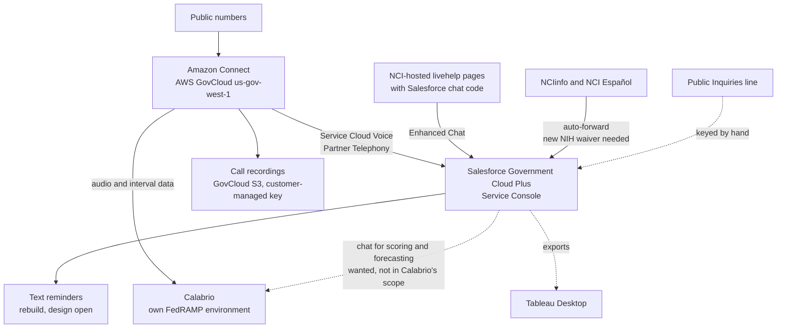

# NCI CIS system landscape

> **Frozen 2026-09-30.** Published to the Notion Project Library as [NCI CIS system landscape](https://app.notion.com/p/3ebd4b877417819a948cde5341c8dfb1). The Notion page is the live copy; edit there, not here.

**Audience:** the Kicksaw delivery team. Read this to understand what the NCI Cancer Information Service (CIS) runs on today, how work moves through it, what replaces it, and what is still open.

**As of 2026-09-30.** Built from every client call through discovery session 5 and the project documents listed below. Each claim carries its source. Anything the record does not state plainly is marked Inferred.

**Go deeper:** Oracle configuration in detail is in the [Oracle org summary](../oracle/oracle-org-summary-2026-09-30.md). How CIS got to its current setup is in [How the CIS contact center got here](cis-contact-center-history-2026-09-30.md). Mapping, Voice, chat, callbacks and security each have a page in the [Notion Project Library](https://app.notion.com/p/3ead4b87741781f98506e27dccd37967), linked where they apply.

## Sources

| Short name | Source | Date |
| --- | --- | --- |
| Reverse demo | [Client walkthrough of the current stack](../discovery/transcripts/2025-07-29-nci-call-center-reverse-demo.md), 96 minutes, before the SOW was signed | 2025-07-29 |
| Handoff brief | Sales to Delivery Handoff Brief v2, Google Drive | 2026-09-02 |
| AWS network PDF | `Amazon_Connect_GovCloud_Network_Architecture.pdf` from Binu Pazhoor, AWS, Google Drive | 2026-07 |
| Kickoff | [Notion Transcripts: Kickoff 2026-09-08](https://app.notion.com/p/3dfd4b877417813dbf24e7369b84f046) | 2026-09-08 |
| Calabrio kickoff | [Notion Transcripts: Calabrio Kickoff](https://app.notion.com/p/3ded4b8774178110be7edbaa19701e83) | 2026-09-14 |
| Session 1 | [Notion Transcripts: Discovery Session 2026-09-15](https://app.notion.com/p/3ded4b87741781bf9cb2c80c4a70d60d) | 2026-09-15 |
| Session 2 | [Notion Transcripts: Discovery Session 2026-09-17](https://app.notion.com/p/3ded4b877417818baca6d7b30a0cfac4) | 2026-09-17 |
| Oracle tour | [Notion Transcripts: Oracle test environment access](https://app.notion.com/p/3e2d4b877417818d9498d08a7b7b9568) | 2026-09-21 |
| Session 3 | [Notion Transcripts: Discovery Session 2026-09-22](https://app.notion.com/p/3e3d4b8774178154bdf0cdbc4803e8b9) | 2026-09-22 |
| AWS call | [Notion Transcripts: AWS GovCloud Discussion](https://app.notion.com/p/3e5d4b87741781efa038d2a413ac7d27) | 2026-09-24 |
| Session 4 | [Notion Transcripts: Workflow Discovery Session, Clinical Trials](https://app.notion.com/p/3e5d4b877417811b881ad8c38f7f7a71) | 2026-09-24 |
| Session 5 | [Notion Transcripts: Discovery Session 2026-09-29](https://app.notion.com/p/3ead4b87741781699e18e77fe9c5503d) | 2026-09-29 |

Speaker labels in the tl;dv and Chorus transcripts are unreliable for Fred Hutch staff. Where a quote below names a speaker, the content has been checked against the surrounding lines.

## The service

CIS answers questions about cancer, clinical trials and quitting tobacco for the public, in English and Spanish, under contract to NCI.

| Attribute | Value | Source |
| --- | --- | --- |
| Information specialists | 40 to 45, close to 100% remote. Calabrio is licensing 60 seats, which may cover supervisors and growth | Handoff brief; Calabrio kickoff |
| Hours | 9 a.m. to 9 p.m. Eastern, federal holiday schedule | Session 5 |
| Inquiries | About 35,000 a year. Daily figures given on the same call (25 to 40) do not add up to that; the counts request asks for the real number | Session 3 |
| Callbacks | About 15,000 to 16,000 a year | Session 5 |
| Call length | Up to an hour. "We are not a speed of service group. We are a quality service." (Mark Hubers) | Session 2 |

## Who contacts CIS

Fred Hutch calls the people who contact the service **clients** and its own staff **information specialists** (Reverse demo).

| Line of service | Who | Ongoing relationship |
| --- | --- | --- |
| Cancer information | Usually a relative or friend of someone recently diagnosed | None today. Holly Fernandez-Johnson would like the option of callbacks later (Session 3) |
| Clinical trials | People looking for a trial. Includes triage for the NCI Center for Cancer Research (CCR) in Bethesda, a job CIS took over from the CCR nurses (Session 4) | Up to 2 callbacks after a trial search (Sessions 1, 3, 4) |
| Tobacco, general public | Smokers, vapers and parents of vaping teens. The highest chat volume (Reverse demo) | Follow-up surveys at about 4, 7 and 13 months for consenting clients; whether this covers the non-VA lines is not confirmed (Session 3) |
| Tobacco, VA veterans | Mostly referred through the VA. Most still arrive on the toll-free number; clinic referrals come through VA Direct and are keyed in by hand (Session 1) | Callbacks, typically 4 or more and up to about 9 with extended callback, plus follow-up surveys (Sessions 1, 3) |

**Anonymous by default, but the CRM holds health data.** Chat asks for no personal information because "the government felt like it was intrusive" (Session 5). Callers are treated anonymously. Even so, the CRM holds health and personal data (PHI and PII) today, and CIS says it holds no card data and no Social Security numbers (Calabrio kickoff). The clinical trials intake collects patient contact details, treatment history and clinical detail such as hormone status (Session 4), and emails often carry a diagnosis (Session 2).

**Retention.** Contacts are deleted after 15 months, and deleting one hides the inquiry's message tab so no health information stays visible. The inquiry and its coding stay permanently for reporting (Sessions 1, 5). Where Oracle runs the purge is unconfirmed ("I want to say File Manager", Session 5).

**Repeat callers.** Within the 15-month window, a returning caller's contact pops with its history, and a new inquiry is still created every time (Repeat-caller contact pops within the retention window, RAID-34). Nothing persists past the purge.

## Today's systems

| System | Role today | Who runs it | In the target |
| --- | --- | --- | --- |
| Oracle Service Cloud (RightNow) | CRM: inquiries, tasks, surveys, knowledge, reports. Windows .NET console; in place since 2012 | Fred Hutch CIS systems team configures it. Oracle hosts it, likely in Oracle's US government cloud (the test instance is on `cx.usg.oraclecloud.com`; Inferred) | Replaced by Salesforce Service Cloud |
| Verizon IVRs | Four menus, each asks English or Spanish first, then routes by line and topic | Verizon | Replaced by Amazon Connect |
| Cisco routing, Finesse and Jabber | Queueing and the specialist's softphone. **Not connected to Oracle** | Verizon operates the telephony | Replaced by Amazon Connect with Salesforce Voice |
| Cisco Unified Intelligence Center | Real-time phone dashboard. Phone only; chat is watched in a separate Oracle dashboard | Fred Hutch (Jennifer Macabeo, Ray Quijano) | Replaced by Amazon Connect and Salesforce reporting |
| Verint | Workforce and quality management. Records all call audio | Fred Hutch | Replaced by Calabrio |
| Amazon Pinpoint | Text reminders before VA callbacks. **Runs in commercial AWS under an exception** | Fred Hutch; built with an AWS engineer | Rebuilt (RAID-39). AWS ends Pinpoint support on 2026-10-30 |
| NIH mailboxes | NCIinfo and NCI Español. Auto-forward to Oracle under an NIH waiver | NIH | Stay. Forward to Salesforce Email-to-Case once NIH approves |
| cancer.gov chat pages | Chat entry. The pages link to an Oracle-hosted launch page, with pop-up invitations | NCI web team; contact Cam Bennett | Stay. Re-pointed to Salesforce Enhanced Chat |
| Public Inquiries (PIQ) line | A private line outside the IVR; specialists key these inquiries in by hand | Fred Hutch | Stays at Fred Hutch, keyed in by hand (Session 5) |
| Tableau Desktop | Analysis across systems, fed by manual exports. Server was ruled out by FedRAMP restrictions | Fred Hutch (Adrianna Gutierrez) | Stays, fed by exports. No direct connection needed (Session 5) |
| Red Sky | E911 address registration for remote specialists | Fred Hutch | Replacement mechanism open |
| Clinical trial search sites | Searches on cancer.gov and clinicaltrials.gov | NCI and NIH | Out of scope, unchanged (RAID-40; Session 4) |
| VA Direct | Secure VA referral inbox | VA | Out of scope; referrals stay manual (RAID-40) |

Oracle's configuration, counted from the test instance: 51 queues, 40 profiles, 21 custom objects, 160 custom fields, 8 service numbers, 5 mailboxes and 2,073 reports. Many are retired or prototypes. The full count, with the Salesforce counterpart for each item, is in [Appendix: Oracle metadata and its Salesforce counterpart](#appendix-oracle-metadata-and-its-salesforce-counterpart). Detail is in the [Oracle org summary](../oracle/oracle-org-summary-2026-09-30.md).

## How work moves today

Solid lines are system connections. Dotted lines are people moving data by hand.

### Phone

Five lines are confirmed live: 1-800-4-CANCER, the smoking quitline, the VA quitline and the CCR line on the IVR menus, and the Public Inquiries line outside them (Session 5). The scope tracker and kickoff say "approximately 10 inbound numbers"; how those map to the five lines is open.

Every IVR asks English or Spanish first. The 1-800-4-CANCER menu then offers cancer information, clinical trials or smoking cessation (Session 1). The IVR passes only the caller's number and the menu choice; nothing is looked up (Session 1).

**Routing today** uses stacked skills: everyone takes cancer calls, some add tobacco, then clinical trials, then Spanish, and a VA smoking group sits alongside (Session 2). Specialist groups were held in reserve so low-volume queues were not starved (Reverse demo). The client now says that approach "is not the most helpful for us now" (Session 2).

**Nothing reaches Oracle from the phone.** The specialist answers on Jabber, opens an inquiry by hand, and types the contact, service number and queue. Because those values no longer arrive, the workspace rules that showed or hid tabs do not fire, so every tab shows and specialists pick the right one from training (Sessions 1, 3).

### Chat

Chat starts with no pre-chat questions. The launch page is Oracle-hosted; six chat queues cover cancer, smoking and clinical trials in English and Spanish. Chat transcripts are offered to the client by email. Spam chats are blocked by IP address, and IP addresses also feed a Tableau map of where chats come from (Session 5; Oracle org summary).

Chat and phone are separate today. Supervisors move specialists between them by telling them to (Session 1; Session 2).

### Email

Two NIH mailboxes are live, NCIinfo and NCI Español, and both auto-forward into Oracle. NIH authorized Oracle to send replies on behalf of nih.gov. Most inbound email is spam (Sessions 2, 5).

Staff on an early shift sort email by hand into general cancer, clinical trials, CCR and Tier 2 Public Inquiries (PIQ), then assign it (Sessions 2, 4). There are no email shifts; email is worked between contacts (Session 4).

Clinical trials messages are always reviewed before sending. General cancer replies are reviewed for newer specialists (Session 3; Session 2 described review as applying to all email). Reviewers edit a copy in a private note because Oracle cannot track draft changes, and the client wants tracked drafting with an audit trail (Session 2).

### Clinical trials and CCR

The clinical trials tab is a structured intake copied from the NIH Clinical Center's own form, and specialists collect it actively (Session 4). CCR and general clinical trial calls come in on different numbers but land in the same English or Spanish clinical trials queue (Session 4).

A trial search passes through several people. The intake specialist sets a "CT search" status, another specialist claims the inquiry by reassigning it, a supervisor reviews the outbound email, and the inquiry should be reassigned back so monthly data credits the right person. That last step is often missed (Session 4). **The Oracle assignee field is therefore not a reliable record of who took the call** (Inferred).

For CCR, the specialist forwards a report from Oracle to a CCR nurse inbox from their own mailbox. The nurses re-key it into their own system, replies reach only that specialist, and "there is no audit log" (Session 4). The CCR web form sits on CCR's own site and arrives as an ordinary email; its field names do not match Oracle's (Session 4).

### Callbacks and follow-up surveys

The [callback lifecycle](https://app.notion.com/p/3ead4b87741781399748cda690996b21) page covers this in full. In short:

- **Callbacks** run for VA quitline clients and after clinical trial searches. They are booked one at a time: the intake specialist books the first, usually within 30 days, and each later one is booked only by whoever reaches the client (Session 3).
- **Each callback has three attempts:** within the scheduled hour, 15 minutes later, and the next business day at the same time. Every attempt is a new task. If all three fail, the series ends (Session 3).
- **Specialists on callback shifts** work a report top down and take no inbound calls during the shift (Session 3). All outbound calling is dialed by hand; nothing depends on campaign dialing (Session 3).
- **Time zones:** clients span the US and its territories, and workspace rules convert their local time to Seattle time (Session 3).
- **Text reminders** go to opted-in VA clients only, before certain attempts. The timing on record conflicts: 24 hours and 3 hours ahead, or 24 hours, 1 hour and a final text (Session 5). Replies go to a CIS mailbox that is read but not answered (Session 5).
- **Follow-up surveys** at about 4, 7 and 13 months are Oracle surveys embedded in the workspace, not tasks. Consent is a question on the demographic survey (Session 3).
- **The VA uses callback data as proof of the contracted work:** every attempt, answer rates and callbacks per client (Session 3).

### Demographics and required surveys

- **Demographics** are required on 25% of cancer and tobacco interactions and 100% of VA interactions, by phone and chat. The 25% is an exact target: going over "overburdens the public". A refusal counts toward it, VA clients surveyed in the last 90 days are skipped, and OMB can change the percentage, so it must be a setting CIS controls (Session 2).
- **Today** an Oracle add-in prompts the specialist when the running rate falls short. Demographics save against a placeholder contact created when the queue is picked, so they are often missed (Sessions 2, 3).
- **The client's biggest request** is to automate this: an automated prompt after a call, a pop-up after a chat (Session 2).
- **A second required survey, client satisfaction,** always goes as an email link (Session 2).

### Knowledge

- **Over 5,000 English and Spanish articles** (Reverse demo; Handoff brief). Melissa's team owns them (Sessions 1, 5).
- **Not published to clients,** but specialists insert article text into chats, emails and printed mailings, and today the whole article goes, staff-only notes included. Each article needs a client-sendable part and an internal-only part (Session 3).
- **English and Spanish pairs** are linked through Oracle's "related answers" feature, repurposed for the purpose, and not every article is paired (Session 1, Inferred from "often").
- **Suggestions** go to Melissa's team by email; Oracle's suggest function is not used (Session 1).
- **Fred Hutch exports the articles** and asked for Excel import templates (Session 1). Oracle allows one full instance export when the account ends (Session 5, hedged). The knowledge session is 2026-10-01.

### Coding

Coding is captured on every inbound interaction, mostly after the call, but not on callbacks, which carry their own fields (Session 3). A general section is filled on every call, then call-type sections follow (Oracle tour). Subject 1 to Subject 4 are ranked, with Subject 1 the primary topic, so a plain multi-select would lose information (Session 1; Inferred for the design point).

### Reporting and monitoring

- **Oracle reports:** 14 years of custom reports, 2,073 in the test instance ([Oracle org summary](../oracle/oracle-org-summary-2026-09-30.md)), many of them prototypes. CIS will show which are used and can export report definitions. Kicksaw's Oracle access excludes reports because they cannot be separated from the data (Sessions 2, 5).
- **Phone metrics** (wait time, abandon rate) live in the Cisco tool, not Oracle (Session 2).
- **Tableau** joins exports from phone, Oracle and quality data on phone number or inquiry ID (Session 2).
- **Status codes** set in the Cisco tool feed workforce management (Session 2).

### Workforce and quality management

- **Verint records all call audio.** The dialed number and call type arrive as metadata, and the Oracle inquiry ID is typed in by hand (Calabrio kickoff).
- **Chats and emails** do not reach Verint, so supervisors score them manually (Reverse demo).
- **Phone and chat forecasting has always been separate** (Calabrio kickoff). The 2025 move did not cause that split.
- **Ray Quijano is new in the workforce manager role** (Session 1). Pain points recorded in July 2025, such as Verint's 15-minute timeout, came from his predecessor and should be rechecked with him.

### Specialist environment

| Attribute | Current state | Source |
| --- | --- | --- |
| Device | Fred Hutch provided, not government issued. The Oracle console is Windows-only | Reverse demo; Oracle tour |
| Network | Fred Hutch GlobalProtect VPN on a dedicated subnet; 80 Mbps home minimum, enforced | Reverse demo |
| E911 | Every specialist holds a dialable Fred Hutch 206 number, via Red Sky | Reverse demo; Handoff brief |
| Admin team | Mostly in Washington state, on Pacific time | Calabrio kickoff |
| Change control | Fred Hutch IT change approval board meets weekly, Thursdays | Session 1 |

## What the 2025 FedRAMP move already broke

Fred Hutch moved into a FedRAMP environment before Kicksaw engaged. The OpenMethods Harmony bar was not FedRAMP-approved, and no replacement was found (Session 1). Losing it cut the phone-to-CRM link: universal queuing, screen pop, automatic filling of the inquiry, rule-driven tabs and repeat-caller history all went. Restoring universal queuing is the client's headline outcome (Universal queuing across voice and chat is restored, RAID-35). See [How the CIS contact center got here](cis-contact-center-history-2026-09-30.md).

## The target

### Decisions that shape it

| Decision | Where recorded |
| --- | --- |
| No standard Salesforce org migration; the only source system is Oracle | RAID-1 |
| Salesforce Government Cloud and AWS GovCloud are both required | RAID-8 |
| Amazon Connect runs in AWS GovCloud, `us-gov-west-1` | RAID-10 |
| Specialists receive and control calls inside Salesforce through Service Cloud Voice | RAID-33 |
| Voice and chat route to the next available specialist (universal queuing) | RAID-35 |
| Specialists work in Salesforce in the browser with no desktop client. Single sign-on is a client preference and a possible enhancement, not a requirement | RAID-36; security baseline |
| The inquiry workspace is streamlined by call type, with coding on every type | RAID-37 |
| Phone numbers, the cancer.gov chat entry and the email address stay; everything behind them changes | RAID-38 |
| Text reminders are rebuilt off Pinpoint | RAID-39 |
| VA Direct intake stays manual; external trial search sites are untouched | RAID-40 |
| Knowledge base migration is in scope | RAID-2 |
| Historical Oracle data is not migrated. Knowledge migrates; callbacks and in-progress work are still to confirm (Session 2 said possibly; Session 5 described articles only). NCI's agreement is open | Session 2; Session 5 |
| Email runs on Salesforce Email-to-Case; Amazon Connect has no email channel in AWS GovCloud | Session 3 guide; [Amazon product and SOW alignment](../project/amazon-product-sow-alignment-2026-09-21.md) |
| Website chat runs on Salesforce Enhanced Chat, with NCI hosting the pages at the existing livehelp addresses | [Enhanced Chat research](https://app.notion.com/p/3ead4b87741781729e8ed15273cd7313), 2026-09-28 |
| Routing at launch is plain: the longest-waiting specialist gets the contact, with language as the only skill split. Prioritization comes after launch | Session 2 |
| Two AWS accounts for Amazon Connect, one non-production paired with the Salesforce Full sandbox and one production. Voice lives in the Full sandbox | [Voice setup gaps](https://app.notion.com/p/3ead4b877417813e8ef1efe7ca66d9bb), 2026-09-28 |
| Fred Hutch's cloud team owns the GovCloud accounts, landing zone guardrails, audit logging and security monitoring. Kicksaw creates the Connect instances and builds flows, queues, routing profiles and callbacks. Mark Hubers and Jennifer Macabeo become Connect administrators | Governing SOW; draft RACI from the AWS call; AWS call |
| No AppExchange package in the Government Cloud org, held as a design constraint | [Amazon product and SOW alignment](../project/amazon-product-sow-alignment-2026-09-21.md) |

### Architecture

- **Salesforce:** Government Cloud Plus, instance USA9014, Unlimited Edition. FedRAMP lists the product as Class D (High); the project's requirement is FedRAMP Moderate. See the [security baseline](https://app.notion.com/p/3ebd4b87741781bead19f77477a4681e).
- **Amazon Connect:** bring-your-own instance in AWS GovCloud. Connect has no license cost; it bills by usage through AWS (AWS call).
- **AWS account layer:** every GovCloud account needs a paired commercial-partition account, used for billing and holding no workloads. Fred Hutch's commercial estate runs on Landing Zone Accelerator with HIPAA guardrails, and that setup can be copied to the GovCloud side. Creating accounts takes "days, not weeks" (AWS call).
- **Calabrio:** workforce and quality management both draw on the one Amazon Connect instance. Calabrio pulls call audio from Connect and keeps it 12 months in its own system. Live call listening comes from Amazon Connect, not Calabrio. Specialists need Calabrio's Smart Desktop Client installed, which CIS does (Calabrio kickoff).

### Region, partition and network

From the AWS network PDF unless marked.

- **Region:** Amazon Connect in GovCloud runs only in `us-gov-west-1`. Instance domain is `*.govcloud.connect.aws`.
- **Partition:** GovCloud is the separate `aws-us-gov` partition, with no cross-partition integration to commercial Lex, Lambda, Kinesis, S3 or CloudWatch.
- **Where data may go (AWS call):** AWS's position is that application data (contacts, recordings) stays in GovCloud, while AWS account-level operator logs can be consolidated with the commercial side. Fred Hutch has not decided.
- **Data that leaves the AWS account by design:** call audio to Calabrio (Calabrio kickoff), and Enhanced Chat's enablement call to a provisioning service outside Government Cloud ([Enhanced Chat research](https://app.notion.com/p/3ead4b87741781729e8ed15273cd7313)).

**Two traffic planes,** designed and tested separately:

| Traffic | Path | Protocol |
| --- | --- | --- |
| Signaling, UI, APIs | Browser to Connect-managed CloudFront and regional endpoints | HTTPS and WebSocket, TCP 443, TLS 1.2 or 1.3 |
| Voice media | Browser directly to TURN load balancer endpoints in `us-gov-west-1` | SRTP and DTLS over UDP 3478 |

CloudFront, the signaling endpoints and the TURN endpoints are run by the Connect service; nobody provisions them (AWS call).

**Allowlist:** domain allowlisting is preferred over IP ranges. Signaling on TCP 443 goes to `*.govcloud.connect.aws`, `*.transport.connect.us-gov-west-1.amazonaws.com`, `*.telemetry.connect.us-gov-west-1.amazonaws.com`, `participant.connect.us-gov-west-1.amazonaws.com`, the `.s3.us-gov-west-1.amazonaws.com` recordings path and the GovCloud static console asset path. Voice media on UDP 3478 goes to `TurnNlb-*.elb.us-gov-west-1.amazonaws.com`. If the firewall errors on more than 2% of 200 or more test calls, fall back to IP ranges from the AWS `ip-ranges.json` `AMAZON_CONNECT` and `EC2` entries for `GLOBAL` and `us-gov-west-1`.

**Voice quality thresholds:** round-trip time at or below 300 ms, one-way latency at or below 150 ms, jitter at or below 30 ms, packet loss at or below 1%. Test tools report round-trip time, so present both figures when validating.

**Encryption:** TLS for signaling; SRTP and DTLS for media; recordings encrypted at rest in GovCloud S3 with a customer-managed key. A FIPS endpoint for the Amazon Connect API is listed for GovCloud; FIPS on the voice media path is the AWS team's to confirm ([Voice setup gaps](https://app.notion.com/p/3ead4b877417813e8ef1efe7ca66d9bb)).

**Naming:** Amazon Connect resource names, descriptions and tags may not contain export-controlled data. Naming conventions are set before the build starts.

### What is not available in Government Cloud

| Not available | Effect on this project |
| --- | --- |
| Amazon Connect email | Email runs on Salesforce Email-to-Case |
| Amazon Connect live media streaming | Salesforce's voicemail depends on it; a voicemail design is open ([Voice setup gaps](https://app.notion.com/p/3ead4b877417813e8ef1efe7ca66d9bb)) |
| Amazon Connect outbound campaigns | Nothing depends on them; all outbound calling is dialed by hand today (Session 3) |
| Amazon Connect Customer Profiles | Not needed; Salesforce holds contacts |
| Contact Lens generative AI and real-time analysis | The client asked for AI that suggests articles and starts coding during the call (Session 1). Any AI needs Fred Hutch and NIH approval, and NIH would not accept a vendor training on CIS data (Session 2) |
| Einstein Bots, Reply Recommendations, Article Recommendations, Case Classification | Interoperable only in Government Cloud Plus, meaning outside the FedRAMP authorization ([Enhanced Chat research](https://app.notion.com/p/3ead4b87741781729e8ed15273cd7313)) |
| Salesforce Authenticator | Interoperable only; passkeys or security keys instead ([security baseline](https://app.notion.com/p/3ebd4b87741781bead19f77477a4681e)) |

## Open items and risks

| Item | Why it matters | Who answers |
| --- | --- | --- |
| **Remote-specialist connectivity.** Specialists are on GlobalProtect VPN; AWS ranks full-tunnel VPN "avoid" for voice. Voice media on UDP 3478 needs split tunneling, media bypass or Direct Connect | A Fred Hutch network change that goes through the weekly change board | Fred Hutch network team (Nicholas Rabena named in the Reverse demo) |
| **Amazon Pinpoint end of support, 2026-10-30.** The console, endpoints, segments, campaigns, journeys and analytics stop; the SMS APIs continue as AWS End User Messaging | VA reminders may break before cutover if they use the retiring features | Fred Hutch cloud team; [SMS reminders options](../salesforce/sms-reminders-options-2026-09-22.md) |
| **Security monitoring after Verizon.** Verizon did log monitoring, alerting and incident response. Nobody owns it for the new stack, and Fred Hutch's tools (CrowdStrike, Cribl) run in commercial AWS | A gap raised by Fred Hutch's own security staff and taken offline (AWS call) | Fred Hutch |
| **Launch permission.** The government needs a detailed technical diagram before launch. Requests go through a federal help-desk queue, and turnaround since federal layoffs is unknown | Schedule risk with no control on our side | Adrianna Gutierrez with NIH's contact Ray (Session 5) |
| **NIH approvals:** a new forwarding waiver to Salesforce, send-as authority for nih.gov, and email signing (DKIM), which only federal staff can set up | Email cannot go live without them | CIS team with NIH (Session 5) |
| **Number porting.** 30-day filing window; the authorization must match Verizon's records exactly; default Connect quotas are 10 numbers and 10 concurrent calls. Fred Hutch is asking NIH who owns the numbers | Sets the go-live critical path | Fred Hutch with AWS Support ([Voice setup gaps](https://app.notion.com/p/3ead4b877417813e8ef1efe7ca66d9bb); Session 5) |
| **Voicemail** without live media streaming in GovCloud | SOW scope | Kicksaw |
| **Unified Routing in Government Cloud Plus.** Recommended for universal queuing; availability not documented | Universal queuing depends on it | Salesforce (Mitchell Rabin) |
| **Chat routing by topic.** Whether clinical trials chats go only to clinical trials specialists, or language is the only split | Decides skills in chat routing | CIS team |
| **Chat into Calabrio.** Wanted for scoring and forecasting; outside Calabrio's statement of work. Trevor Holt is sizing it | Combined phone and chat forecasting stays unsolved without it | Calabrio |
| **Forecasting history at go-live.** If Connect and Calabrio go live together, there is no Connect history to forecast from | A data item beside the migration | Calabrio, CIS team |
| **Calabrio cutover.** No after-hours work in Calabrio's statement of work, including cutover; Calabrio requires a signed UAT document before production | Cutover planning | Calabrio (Calabrio kickoff) |
| **E911 mechanism** for remote specialists in GovCloud | Life safety | AWS, Fred Hutch |
| **Specialist direct numbers.** Porting Fred Hutch numbers breaks up the range; claiming new AWS numbers may be cleaner | Porting scope | Fred Hutch |
| **Knowledge export** format, the one-export limit, whether sibling links survive, and the sendable versus internal split | Knowledge migration design | CIS team, knowledge session 2026-10-01 |
| **Callbacks and in-progress work at cutover** | Data migration scope | CIS team |
| **Volumes:** interactions, callbacks, texts, users, articles | Sizing | [Counts Request Session 5](https://app.notion.com/p/3ead4b87741781f0bb0cdf0d694678b0) |
| **CCR forwarding** sends patient health details by email from individual mailboxes with no audit trail | Design of the CCR handoff in Salesforce | CIS team, CCR |
| **Social media.** On hold in July 2025, but described as current on later calls | Channel scope | CIS team |

## Constraints on how the service runs

- **Outages must be reported within one hour** under the NCI contract (Reverse demo).
- **The contract is competitively re-bid,** so reliability and support tiers matter to CIS (Reverse demo).
- **Support ownership has shifted to Fred Hutch,** which now contracts each vendor directly (Reverse demo; Handoff brief).
- **Demographic survey rates are set by the government** and must be hit exactly (Session 2).
- **The VA audits callback effort** through callback data (Session 3).
- **AI features stay off** unless Fred Hutch and NIH approve them (Session 2). CIS expects AI to be off by default (Calabrio kickoff).
- **Version currency matters.** Falling behind on updates causes dropped calls, so every upgrade gets a full test cycle (Reverse demo).

## Appendix: Oracle metadata and its Salesforce counterpart

Counts come from the Oracle test instance (`NCI__TST`), a copy of production from mid-2025, so production may differ slightly. Rows marked **console** are items the REST API does not expose; their counts come from the Oracle tour and the [console pull checklist](https://app.notion.com/p/3ead4b87741781c2a7a4ff31806351f5), and nobody has captured them yet. Every other count is from the 2026-09-23 metadata pull. Salesforce targets follow the [mapping framework](https://app.notion.com/p/3ead4b877417816383aff1369c4596d1) unless marked Inferred. Detail for each row is in the [Oracle org summary](../oracle/oracle-org-summary-2026-09-30.md).

| Area | Oracle item | Count | Salesforce or Amazon Connect counterpart | What comes over |
| --- | --- | --- | --- | --- |
| Data model | Standard objects in use: Inquiry, Task, Contact, Answer, Chat, Staff account | 6 | `Case` (one record type per call type), `Task` or a callback object, `Contact`, Knowledge, Messaging Session, `User` | All six, redesigned |
| Data model | Standard objects not used: Organization, Asset, Opportunity, SLA entitlement | 4 | None | Nothing |
| Data model | Custom objects | 21 in 4 packages: 10 hold data, 11 are picklist lists | SCIF becomes a `Case` child object entered through a Screen Flow. DEMOGR follows the survey design. Referrals is not placed yet. OpenMethods (3) retires with Service Cloud Voice | SCIF; DEMOGR and Referrals to confirm |
| Data model | Custom fields | 160: Inquiry 116, Answer 25, Task 16, Contact 3 | Custom fields on `Case`, Knowledge, the callback object and `Contact` | Only fields in use. Field visibility is a console capture |
| Data model | SCIF form fields | 116 | Fields on the SCIF child object | CIS offered to shorten it |
| Data model | Picklists | 142 lists, 3,842 values, 66 of them separators | Picklist fields and global value sets | Values in use, without separators |
| Data model | Product, category and disposition trees | 7, 29 and 25 values | Knowledge data categories for products and categories. Dispositions to a `Case` picklist (Inferred) | To confirm per tree |
| Statuses | Inquiry statuses | 13: 10 real, 3 placeholders | `Case` Status values | The 10 real ones |
| Statuses | Task statuses | 5 | Task or callback status values | Redesigned with callbacks |
| Statuses | Answer statuses | 7 | Knowledge publication and validation status (Inferred) | Redesigned with Knowledge |
| Channels | Service numbers (phone lines) | 8 | Amazon Connect phone numbers, plus a service number field on `Case` | 4 lines move to Connect; Public Inquiries stays at Fred Hutch; 3 to confirm |
| Channels | Queues | 51 named, plus 5 separator rows | Omni-Channel queues and Amazon Connect queues | 17 carry forward, 6 do not, 28 to confirm |
| Channels | Chat queues (within the 51) | 6 | Omni-Channel queues for Enhanced Chat | All 6 |
| Channels | Mailboxes | 5 | Email-to-Case routing addresses | 2: NCIinfo and NCI Español |
| Channels | Interfaces | 3: English, Spanish, staging | English and Spanish handling on the case and chat deployment (Inferred) | The need to tell the languages apart; staging does not come over |
| Channels | Chat hours | 1 per interface (3), console | Enhanced Chat business hours | Carries forward |
| Service | Response requirements | 1 per interface (3), console | Entitlements and milestones, or a due date set by Flow | The due-date need |
| Service | SLAs | 0 | None | Nothing |
| Service | Holidays | 17, for 2025 to 2027 | Salesforce holidays and business hours; Amazon Connect hours of operation | Federal holiday schedule |
| Automation | Workspaces | At least 1 live (NCI Inquiry v2.1); task, contact and SCIF workspaces expected. Console | Lightning record pages with Dynamic Forms, one per record type | Redesigned by call type (RAID-37) |
| Automation | Workspace rules | Unknown. Console | Dynamic Forms visibility rules, validation rules, before-save Flows | Active rules only |
| Automation | Business rule bases | 6 in scope: inquiry, task, contact, answer, chat, organization. Rules per base unknown. Console | Before-save and after-save Flows, one pair per object | Active rules only |
| Automation | Custom processes (object event handlers) | Unknown. Console | Apex or Flows | To confirm |
| Automation | Agent scripts and guided assistance | Unknown. Console | Screen Flows | To confirm |
| Automation | Add-ins | At least 2: OpenMethods telephony, demographics pop-up. Console | Service Cloud Voice replaces the telephony add-in; the demographics survey is redesigned | Neither as-is |
| Automation | Event subscriptions | 0 | None | Nothing |
| Access | Profiles | 40, of which 8 are test, UAT or copies | A minimal profile plus permission set groups per role | Designed fresh |
| Access | Staff groups | 8 | Public groups and queue membership | Inform the design |
| Access | Navigation sets | Unknown, at most 40 (one per profile). Console | Lightning apps per role | Redesigned |
| Access | Staff accounts | Not counted | `User`, plus an Amazon Connect user with a routing profile | Active users only |
| Content | Knowledge articles (answers) | About 5,000, English and Spanish | Salesforce Knowledge, bilingual, with a sendable part and an internal part | All, by Fred Hutch export |
| Content | Standard content | 352: 327 with hot keys, 151 with an HTML version | Quick Text and Lightning email templates | Rebuilt |
| Content | Message templates | Unknown, repeated per interface. Console | Lightning email templates | Templates CIS changed from default |
| Content | Surveys | 28 | Salesforce Surveys or Feedback Management, or Amazon Connect phone surveys. Not settled | At least 3 types: demographics, client satisfaction, tobacco follow-up |
| Content | Reports | 2,073: 1,051 stock, 1,022 custom, 49 custom updated since 2021 | Salesforce reports and dashboards; Amazon Connect metrics for telephony | Only reports CIS names |
| Data | Retention settings | 2 settings plus Data Lifecycle policies. Console | A scheduled purge of contacts (Inferred) | The 15-month contact deletion |
| Data | Historical records | 14 years of inquiries and contacts | None | Nothing; start fresh |

## Change log

| Date | Change |
| --- | --- |
| 2026-09-30 | Added the appendix counting Oracle metadata by type, with the Salesforce or Amazon Connect counterpart and what comes over |
| 2026-09-30 | Rewritten from every client call through discovery session 5 and the project documents since 2026-09-12. Replaces system-landscape-2026-09-12.md |
| 2026-09-12 | First version, from the July 2025 reverse demo, the handoff brief, the AWS network PDF and the kickoff |
